

# Dev_Setup
Setup Development Environment

#Assignment: Setting Up Your Developer Environment

#Objective:
This assignment aims to familiarize you with the tools and configurations necessary to set up an efficient developer environment for software engineering projects. Completing this assignment will give you the skills required to set up a robust and productive workspace conducive to coding, debugging, version control, and collaboration.

#Tasks:

1. Select Your Operating System (OS):
   Choose an operating system that best suits your preferences and project requirements. Download and Install Windows 11. https://www.microsoft.com/software-download/windows11

   How to Download and Install:
1.Visit the official Microsoft website: https://www.microsoft.com/software-download/windows11
2.Click on the "Download Now" button under "Windows 11."
3.Choose the edition of Windows 11 that suits your needs.
4.Run the downloaded installer and follow the on-screen prompts to 
5.complete the installation process.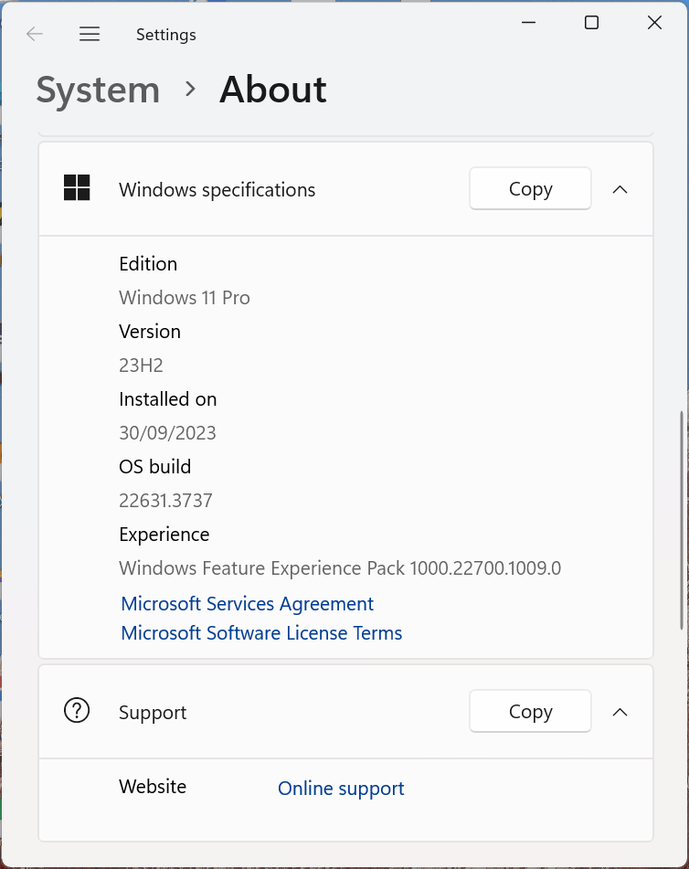

2. Install a Text Editor or Integrated Development Environment (IDE):
   Select and install a text editor or IDE suitable for your programming languages and workflow. Download and Install Visual Studio Code. https://code.visualstudio.com/Download

1.	Visit the Download Page:
Click on the provided link: https://code.visualstudio.com/Download
2. Select Your Operating System:
•	Choose the appropriate version for your operating system (Windows, macOS, or Linux). For me is windows.
3. Download the Installer:
•	Click on the "Download" button for the installation file.
4. Run the Installer:
•	Once the download is complete, run the installation file.
5. Follow the On-Screen Instructions:
•	Select the installation directory and accept the license agreement.
•	Choose the additional components you want to install.
•	Click on "Install" to start the installation.
6. Complete the Installation:
•	The installation process will take a few minutes.
•	Once complete, click on "Launch" to open Visual Studio Code.
7. Verify Installation:
•	You should now see the Visual Studio Code welcome screen.
•	Click on "Create a New File" or open an existing file to begin using the IDE

3. Set Up Version Control System:
   Install Git and configure it on your local machine. Create a GitHub account for hosting your repositories. Initialize a Git repository for your project and make your first commit. https://github.com

   Step 1: Install Git
For Windows: Download and install Git for Windows from the official website: https://git-scm.com/download/win.
Step 2: Configure Git
    step 2: Git configure
1.Open Terminal or Command Prompt.
2.Run the following commands to configure global settings 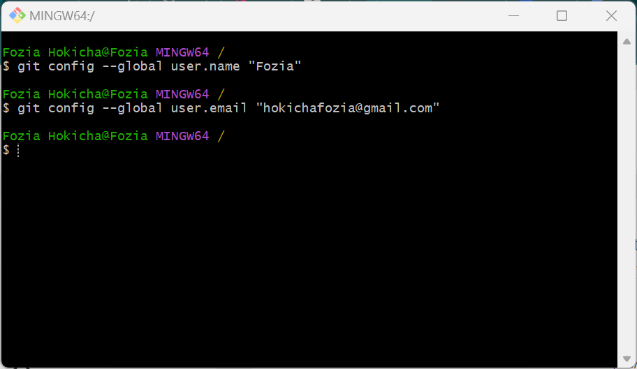
    step 3.Create a GitHub Account:
1.Go to https://github.com
2.Click "Sign up" and follow the instructions to create an account.
    step 4. Initialize a Git Repository:
1.Navigate to the directory where your project is located.
2.Run the following command to initialize a Git repository:

4. Install Necessary Programming Languages and Runtimes:
  Instal Python from http://wwww.python.org programming language required for your project and install their respective compilers, interpreters, or runtimes. Ensure you have the necessary tools to build and execute your code.

  1. Download and Install Python
1.	Download Python: Go to the official Python website and download the latest version of Python for Windows.
2.	Run the Installer:
o	Open the downloaded installer.
o	Check the box that says "Add Python to PATH".
o	Click on "Install Now".
2. Verify the Installation
Open Command Prompt and run the following commands to verify that Python and pip (the package installer for Python) are installed correctly: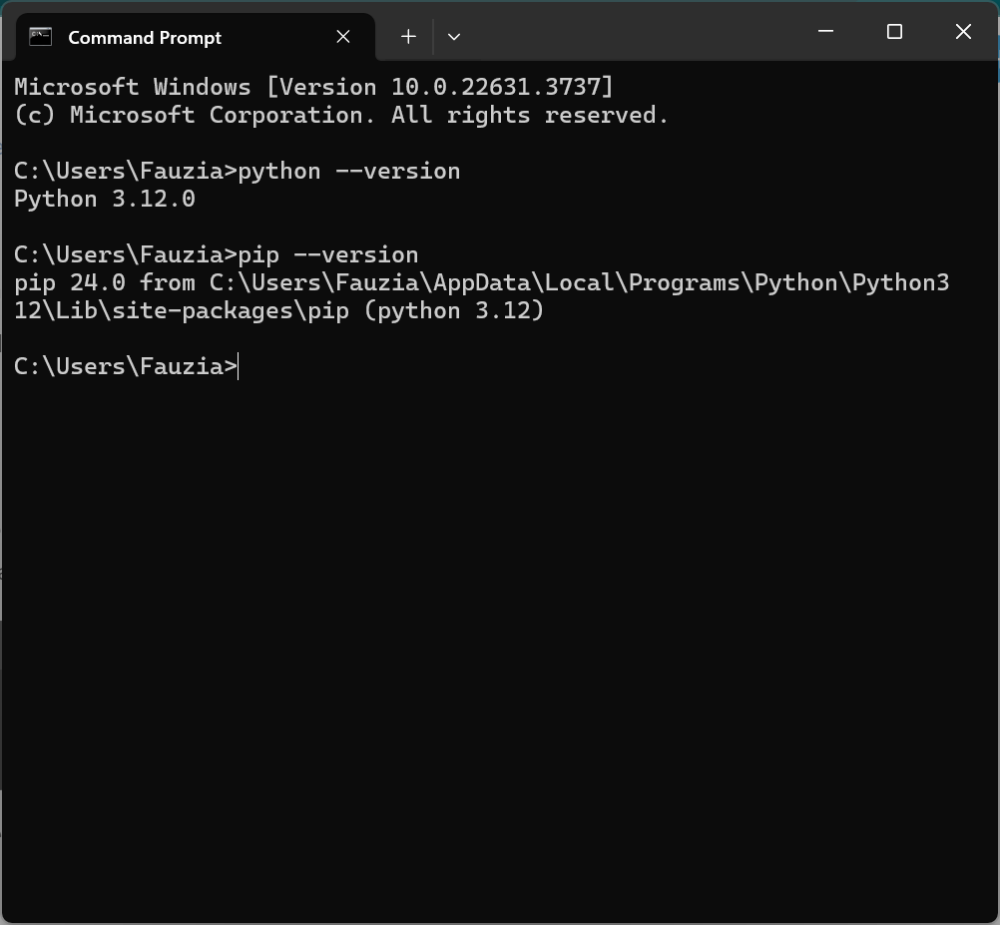
3. Install Python Packages
 add Python packages for your project. You can install them using pip. For example: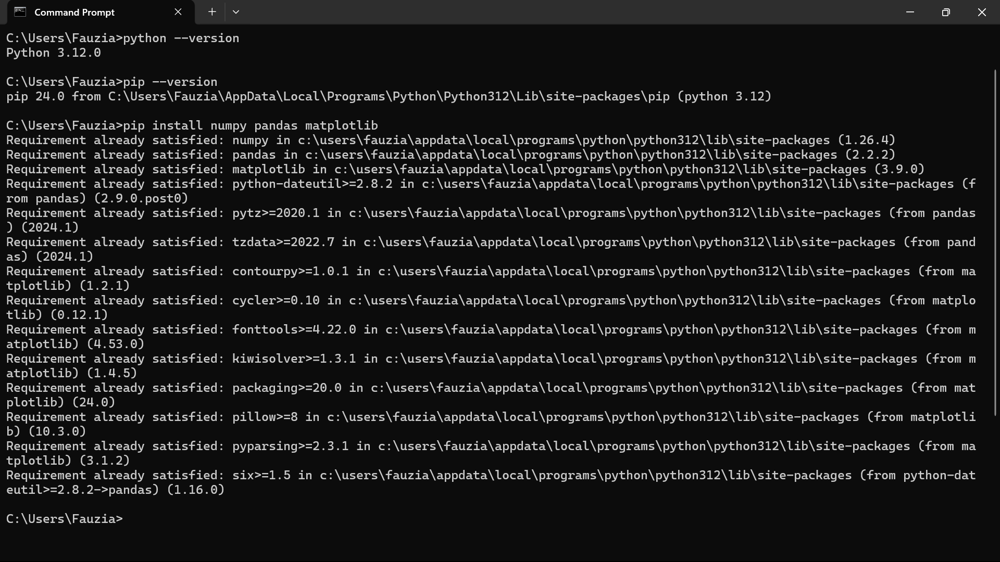
 
4. Set Up a Virtual Environment (Optional but Recommended)
Using a virtual environment helps to manage dependencies and avoid conflicts between different projects.
1.Create a Virtual Environment:
Navigate to your project directory and run:

5. Install Package Managers:
   If applicable, install package managers like pip (Python).
have installed and verified the package managers pip for Python . Additionally,  install pipenv and yarn for managing packages in Python . These tools will help you manage project dependencies effectively.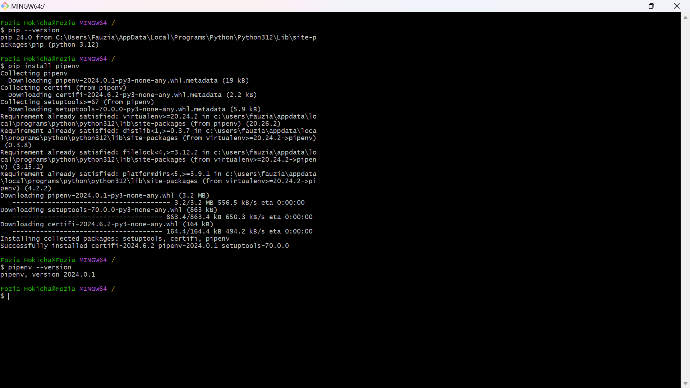

6. Configure a Database (MySQL):
   Download and install MySQL database. https://dev.mysql.com/downloads/windows/installer/5.7.html

   1. open mysql command line
   2. enter password
   3. create database 
   4. Create Employee table 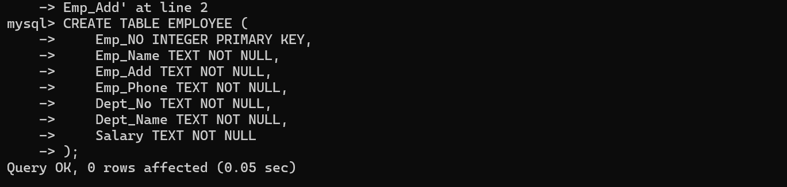
   5. fill in the  necessary details for the employees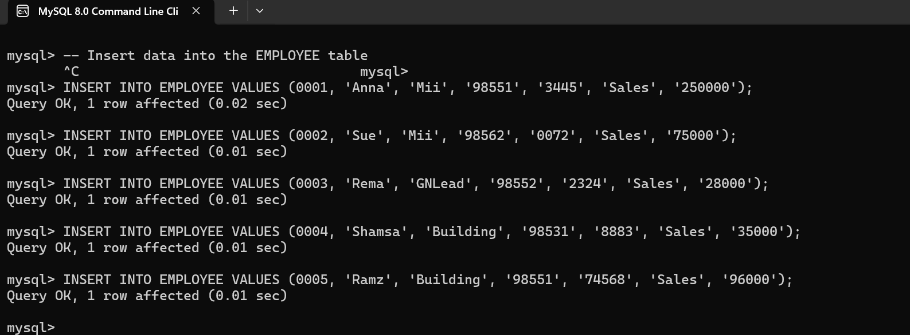
   6. company table 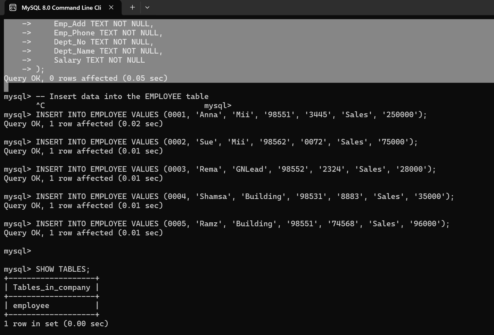
   7. table decription 
   8. MySQL workbench 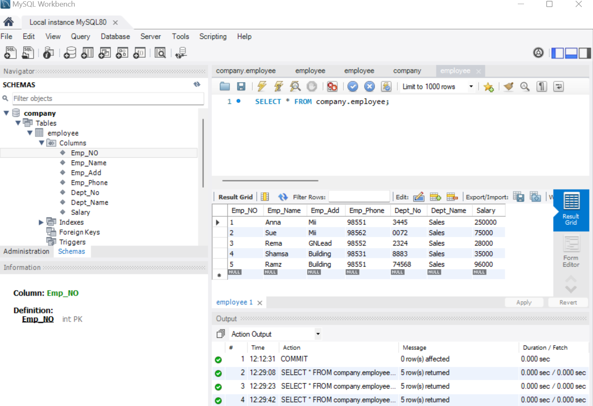

7. Set Up Development Environments and Virtualization (Optional):
   Consider using virtualization tools like Docker or virtual machines to isolate project dependencies and ensure consistent environments across different machines.

   1. download Docker from:https://www.docker.com/products/docker-desktop/
   2. check the requirents for the installation of docker e.g 1. windows 11, wsl        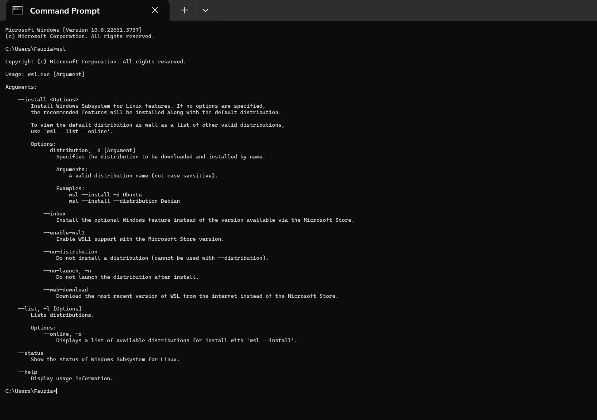
   3. enable wsl features on. Enable windows sussistence for linux.
   4. check visualization is enable in BIOs
   5. install docker app and restart pc
   6. download node.js
   7. open git hub and veryfy the version
   8. gitbash node version 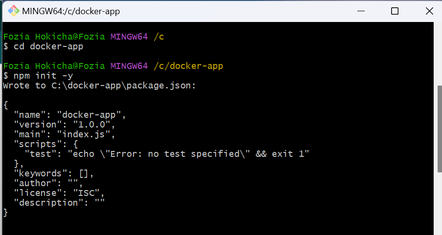
   9. create codes in notepad and save as  app.js in the c:\docker-app directory.
   10 . confirmed that the app.js file exists in the correct directory, try running the script again: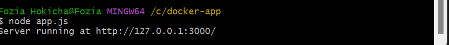
   11. [server running](image-13.png) server is running, and you can access the application at http://127.0.0.1:3000/.

8. Explore Extensions and Plugins:
   Explore available extensions, plugins, and add-ons for your chosen text editor or IDE to enhance functionality, such as syntax highlighting, linting, code formatting, and version control integration.
   1.Visual Studio Code (VS Code) is a highly popular and versatile code editor with a wide range of extensions and plugins available to enhance its functionality. Here are some essential and useful extensions and plugins for various purposes:

1. Programming Language Support
Python
Extension: Python by Microsoft
Functionality: Provides IntelliSense (autocompletion), linting, debugging, and support for Jupyter Notebooks.
Install: Search for "Python" in the Extensions view.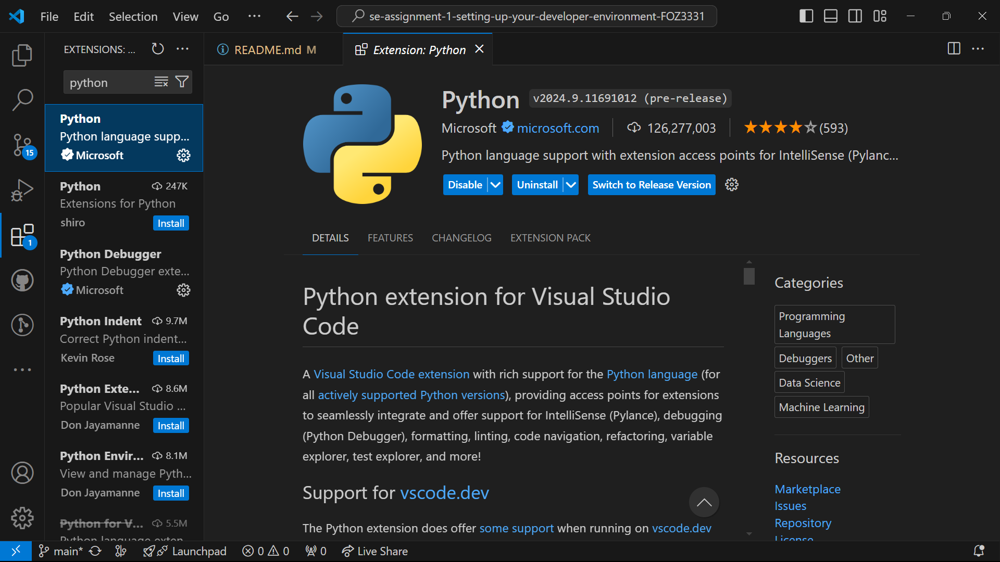
2. Code Formatting and Linting
Extension: Prettier - Code formatter
Functionality: Automatically formats code according to a specified style.
Install: Search for "Prettier - Code formatter" in the Extensions view.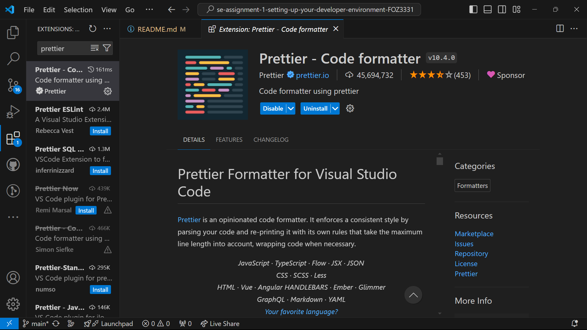
3. Version Control Integration
GitLens
Extension: GitLens — Git supercharged
Functionality: Enhances Git capabilities with features like blame annotations, repository explorer, and more.
Install: Search for "GitLens" in the Extensions view.
4. Docker and Virtualization
Extension: Docker by Microsoft
Functionality: Provides tools to build, manage, and deploy Docker containers.
Install: Search for "Docker" in the Extensions view.
5. Remote Development
Extension: Remote - WSL
Functionality: Use the Windows Subsystem for Linux (WSL) as your development environment.
Install: Search for "Remote - WSL" in the Extensions view.

9. Document Your Setup:
    Create a comprehensive document outlining the steps you've taken to set up your developer environment. Include any configurations, customizations, or troubleshooting steps encountered during the process. 

    1. 1. Install Git and Configure
Step 1: Install Git
Download and install Git from the official Git website.
Step 2: Configure Git
Open Git Bash and configure your Git username and email: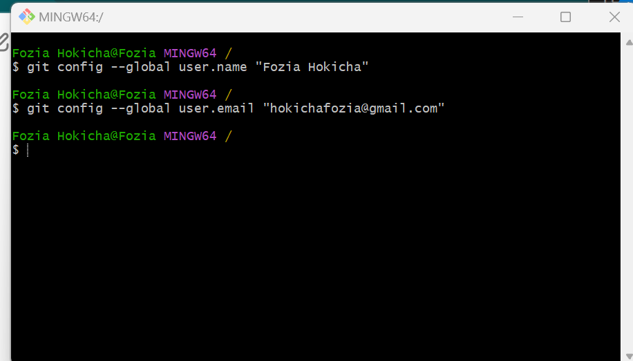
3. Initialize a Git Repository
Step 1: Create a Project Directory
Navigate to your desired directory and create a new project folder:
Step 2: Initialize Git
Initialize a Git repository in your project directory: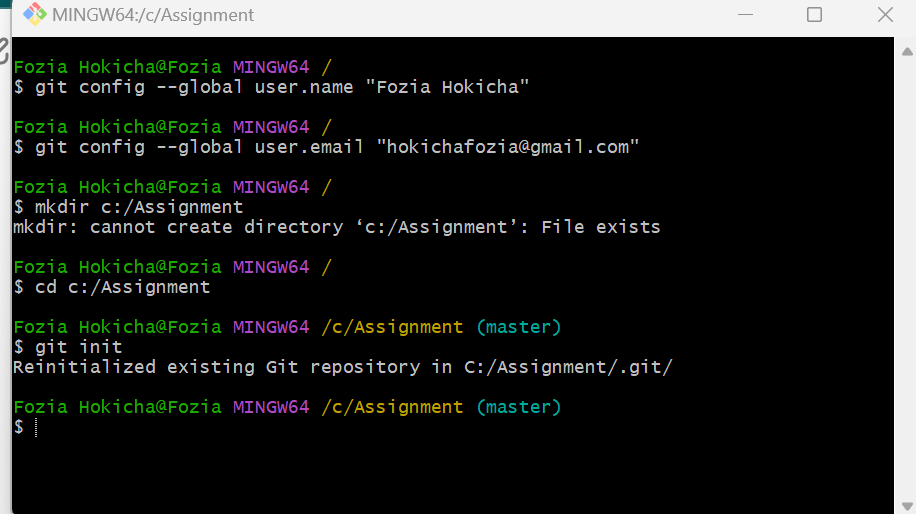
4. Install Necessary Programming Languages and Runtimes
Step 1: Install Python
Download and install Python from the official Python website. Ensure to check the option to add Python to your PATH during installation.
Step 2: Verify Python Installation
Open a command prompt and verify the installation: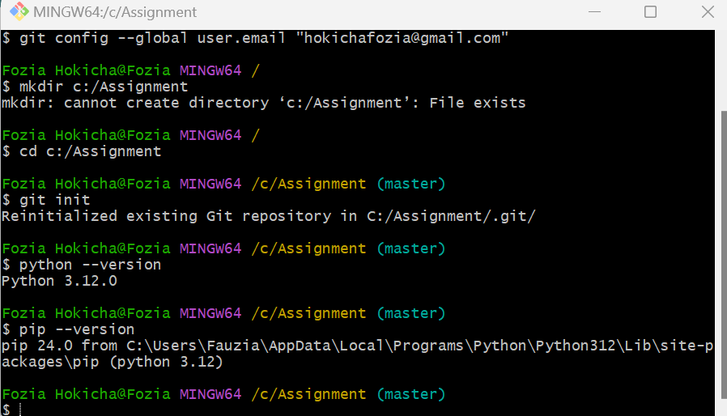
Step 3: Install Node.js
Download and install Node.js from the official Node.js website.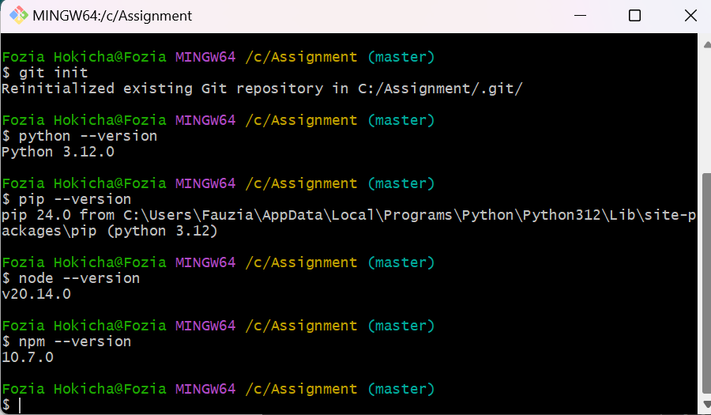
5. Install Package Managers
Step 1: Install pip for Python
Pip is included by default with Python 3. Ensure it is installed:
Step 2: Install npm for Node.js
Npm is included by default with Node.js. Ensure it is installed:
6. Configure a Database (MySQL)
Step 1: Install MySQL
Download and install MySQL from the MySQL official website.
Step 2: Verify MySQL Installation
Open MySQL and create a database: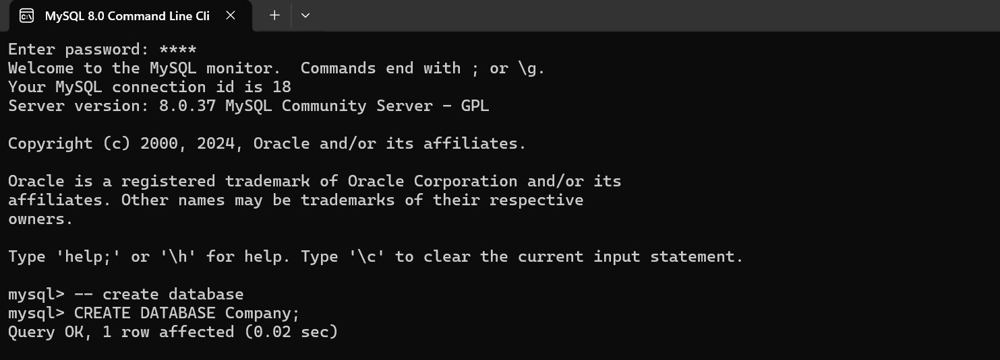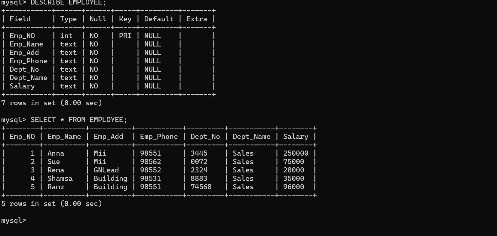
7. Push MySQL Database to GitHub
Step 1: Export MySQL Database
Export the database to a SQL file using mysqldump:
Step 2: Push to GitHub
Initialize a new repository on GitHub and push your SQL file:
8. Set Up Development Environments and Virtualization
Step 1: Install Docker
Download and install Docker from the Docker official website.
Step 2: Verify Docker Installation
Open a command prompt and verify the installation: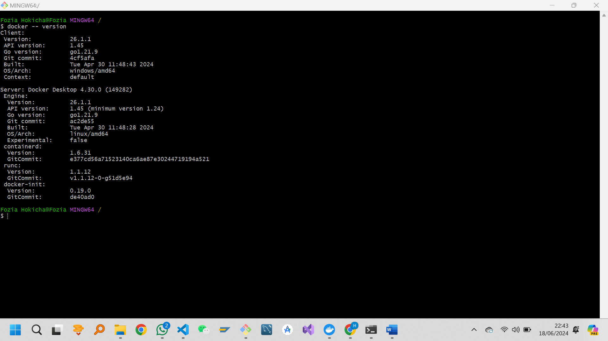
Step 3: Create a Docker Application
Create a simple Node.js application and Dockerize it:
Create a Dockerfile:
Create a docker-compose.yml:
Build and run the Docker container:

#Deliverables:
- Document detailing the setup process with step-by-step instructions and screenshots where necessary.
- A GitHub repository containing a sample project initialized with Git and any necessary configuration files (e.g., .gitignore).
- A reflection on the challenges faced during setup and strategies employed to overcome them.

#Submission:
Submit your document and GitHub repository link through the designated platform or email to the instructor by the specified deadline.

#Evaluation Criteria:**
- Completeness and accuracy of setup documentation.
- Effectiveness of version control implementation.
- Appropriateness of tools selected for the project requirements.
- Clarity of reflection on challenges and solutions encountered.
- Adherence to submission guidelines and deadlines.

Note: Feel free to reach out for clarification or assistance with any aspect of the assignment.
